<div align="center">



<br><br>

<a href="https://www.linkedin.com/in/breno-ludgerio-450070369/">
  
</a>
<a href="https://github.com/ludgerios?tab=followers">
  
</a>

</div>

---

## Sobre mim

Sou estudante de **Análise e Desenvolvimento de Sistemas** e atuo como **estagiário de IT Service Management (ITSM) na Vale**, com foco em **ServiceNow, automação de processos e integrações**.

Minha rotina envolve desenvolvimento, testes e evolução de soluções corporativas relacionadas a **Incident Management, Problem Management, CMDB e continuidade de serviços**, conectando regras de negócio a automações e integrações entre plataformas.

- Desenvolvimento server-side em **JavaScript no ServiceNow**
- Automação com **Microsoft Power Automate, Microsoft Teams e Adaptive Cards**
- Integrações com **REST APIs, Scripted REST APIs e JSON**
- Manipulação de dados com **SQL Server e T-SQL**
- Trabalho com **SharePoint, Azure DevOps, Git e GitHub**

---

## Atuação técnica

| Área | Experiência prática |
|---|---|
| **ServiceNow** | Business Rules, Scheduled Jobs, Flow Designer, UI Policies, Dictionary, Events, Notifications, Update Sets e Schedules |
| **Scripting** | JavaScript server-side, GlideRecord, GlideDateTime e regras orientadas a eventos |
| **ITSM** | Incident Management, Problem Management, CMDB e continuidade de serviços |
| **Automação** | Microsoft Power Automate, Microsoft Teams e Adaptive Cards |
| **Integrações** | REST APIs, Scripted REST APIs, JSON e integrações entre sistemas |
| **Dados** | SQL Server e T-SQL |
| **Entrega** | Desenvolvimento, testes em DEV/QA, validação técnica e transporte via Update Sets |
| **Ferramentas** | Azure DevOps, SharePoint, Git, GitHub e VS Code |

---

## Tecnologias

<p align="center">
  
</p>

<p align="center">
  
  
  
  
</p>

<p align="center">
  
  
  
  
</p>

---

## O que faço na prática

```text
ServiceNow
├── Regras de negócio e automações
├── Scheduled Jobs e processamento de prazos
├── Events e Notifications
├── Flow Designer
├── GlideRecord / GlideDateTime
├── Incident / Problem / CMDB
└── REST e Scripted REST APIs

Automação e Integração
├── Microsoft Power Automate
├── Microsoft Teams
├── Adaptive Cards
├── SQL Server / T-SQL
├── SharePoint
├── Azure DevOps
└── JSON / REST APIs
```

Meu foco é transformar regras de negócio em soluções técnicas que **reduzam atividades manuais, aumentem a confiabilidade dos processos e integrem diferentes ferramentas de tecnologia**.

---

## Estatísticas

<p align="center">
  
</p>

<p align="center">
  
  
</p>

<p align="center">
  
  
</p>

---

## Contato

<p align="center">
  <a href="https://www.linkedin.com/in/breno-ludgerio-450070369/">
    
  </a>
</p>

<div align="center">

**ITSM • ServiceNow • Automation • Integrations • Development**

</div>
